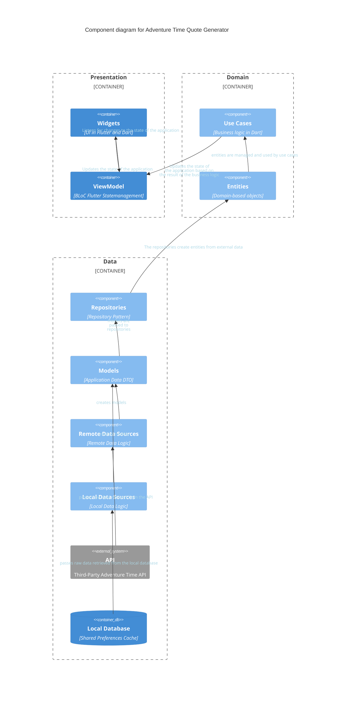

# Tech Used

* Flutter
* Dart
* Third-Party API

# Project Details

Adventure Time Quote Generator is a simple application that generates a quote using a third party API.
It was built for the sole purpose of testing Clean Architecture in a Flutter project.

Check the code out on [GitHub](https://github.com/DanArcherOnline/Adventure_Time_Quote_Generator).

Below is a Mermaid chart showing the Clean Architecture of the app and the relationships between the different layers.

